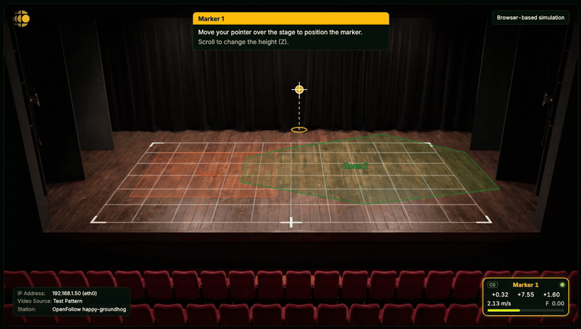

<p align="center">
  
</p>

<p align="center">
  Track people and objects on stage with a live video overlay, and broadcast positions via PSN (PosiStageNet) and OTP (Object Transform Protocol) to show control tools like lighting consoles, tracker processors, media servers, and audio processors.</p>
<p align="center">
  <b>Raspberry Pi is the recommended deployment target.</b> macOS support is for development only.
</p>

<p align="center">
  <a href="../../actions/workflows/ci.yml"></a>
  <a href="../../releases/latest"></a>
  <a href="https://buymeacoffee.com/openfollow"></a>
</p>

<p align="center">
  <a href="https://openfollow.app">Website</a> &nbsp;·&nbsp;
  <a href="../../releases">Releases</a> &nbsp;·&nbsp;
  <a href="#raspberry-pi-deployment-recommended">Install</a> &nbsp;·&nbsp;
  <a href="#webinterface">Web UI</a> &nbsp;·&nbsp;
  <a href="#for-developers">Developers</a> &nbsp;·&nbsp;
  <a href="#license">License</a>
</p>

---

<p align="center">
  
</p>

## Overview

You get a live video view with an overlay, control 3D markers with a gamepad, mouse, or keyboard, and broadcast their positions to show-control tools like lighting consoles and media servers.

> [!WARNING]
> OpenFollow is intended to coordinate visual and audio elements of a production and should not be used for safety critical applications.

### Video input

| Source | Notes |
| --- | --- |
| RTSP / SRT / RTP | Network video streams |
| NDI® | Requires the [NDI SDK](https://ndi.video/for-developers/ndi-sdk/) (NDI® is a registered trademark of Vizrt NDI AB) |
| Raspberry Pi Camera | CSI / MIPI ribbon camera |
| USB camera / HDMI capture card | V4L2 |

### Key features

- **Interactive overlay** – position 3D markers on a live video view
- **Multi-protocol output** – PSN, OTP, OSC, and RTTrPM for industry-standard show-control integration (see [Integrations](#integrations))
- **OSC input** – receive `/marker/{id} x y z` position jumps
- **Flexible video inputs** – network sources + Pi camera
- **Web UI configuration** – no manual file editing
- **Affordable hardware** – designed to run reliably on a Raspberry Pi

### Integrations

OpenFollow broadcasts marker positions over four industry-standard protocols:

| Protocol | What it is | Spec |
| --- | --- | --- |
| PSN | PosiStageNet stage-position protocol | [posistage.net](https://posistage.net/) |
| OTP | Object Transform Protocol | [otprotocol.org](https://otprotocol.org/) |
| OSC | Open Sound Control messages | – |
| RTTrPM | Real-Time Tracking Protocol (Motion) | [RTTrPM wiki](https://rttrp.github.io/RTTrP-Wiki/RTTrPM.html) |

Known-compatible tools include grandMA3, ETC Eos 3.3, QLab 5, ADM OSC, LightStrike, ETC Hog 5, ChamSys, Avolites, and many more.

## Table of contents

- [Raspberry Pi deployment (recommended)](#raspberry-pi-deployment-recommended)
  - [Option 1: flash the ready-made image (CM5 or Pi 5)](#option-1-flash-the-ready-made-image-cm5-or-pi-5)
  - [Option 2: install the `.deb` package (other Pi models)](#option-2-install-the-deb-package-other-pi-models)
  - [Updating OpenFollow](#updating-openfollow)
- [Webinterface](#webinterface)
- [Security notes](#security-notes)
- [For developers](#for-developers)
  - [Development environment (macOS)](#development-environment-macos)
  - [Development environment (Linux – Debian/Ubuntu)](#development-environment-linux--debianubuntu)
  - [Source-based install on a Raspberry Pi](#source-based-install-on-a-raspberry-pi)
  - [Managing the service](#managing-the-service)
  - [Testing](#testing)
  - [Runtime baseline capture](#runtime-baseline-capture)

---

## Raspberry Pi deployment (recommended)

Install a pre-built release from the [Releases page](../../releases). Pick the
artifact for your hardware:

| Hardware | How to install |
| --- | --- |
| Compute Module 5 (eMMC) | Flash the ready-made image – [Option 1](#option-1-flash-the-ready-made-image-cm5-or-pi-5) |
| Raspberry Pi 5 (SD card) | Flash the ready-made image – [Option 1](#option-1-flash-the-ready-made-image-cm5-or-pi-5) |
| Any other 64-bit Raspberry Pi | Install the `.deb` package – [Option 2](#option-2-install-the-deb-package-other-pi-models) |
| Other Debian machine | [Manual install](#manual) (not actively maintained) |
| macOS | [Dev setup](#development-environment-macos) (not actively maintained) |

### Option 1: flash the ready-made image (CM5 or Pi 5)

The image is Raspberry Pi OS Lite with OpenFollow pre-installed; it boots straight
into the app. Download the artifact for your board from the
[Releases page](../../releases):

- **Compute Module 5** → `openfollow-cm5_<version>.img.xz` (flashed to the eMMC over USB)
- **Standard Raspberry Pi 5** → `openfollow-pi5_<version>.img.xz` (flashed to a microSD card)

**Compute Module 5 (eMMC):**

1. Put the CM5 IO board into rpiboot/usbboot mode so the eMMC appears as a USB drive
   ([IO board setup + flashing](https://www.raspberrypi.com/documentation/computers/compute-module.html#set-up-the-io-board), [macOS walkthrough](https://www.jeffgeerling.com/blog/2020/flashing-raspberry-pi-compute-module-on-macos-usbboot/)).
2. In **Raspberry Pi Imager**: **Choose OS → Use custom**, select `openfollow-cm5_<version>.img.xz`.
3. **Choose Storage** → the CM5 eMMC → **Write**.
4. Reboot the CM5 – it comes up running OpenFollow on HDMI.

**Standard Raspberry Pi 5 (SD card):**

1. Insert a microSD card (8 GB or larger) into your computer.
2. In **Raspberry Pi Imager**: **Choose OS → Use custom**, select `openfollow-pi5_<version>.img.xz`.
3. **Choose Storage** → the microSD card → **Write**.
4. Insert the card into the Pi 5 and power on – it comes up running OpenFollow on HDMI.
   The rootfs auto-expands to fill the card on first boot.

Open the Web UI at `http://<pi-ip>:80` to configure it.

### Option 2: install the `.deb` package (other Pi models, or an x86_64 PC)

Needs internet so `apt` can pull the package's system dependencies. Works on a Pi
(`arm64`) and on a commodity x86_64 box – mini-PC, NUC, or laptop – (`amd64`). Two
requirements: the package bundles a **Python 3.13** venv, so the host must be
**Debian 13 (Trixie)** or a derivative on the same Python (Raspberry Pi OS is
Trixie-based) – Ubuntu 24.04 / Debian 12 ship an older Python and will refuse to
install; and it runs a **fullscreen display kiosk**, so the machine needs a GPU +
monitor (a headless server or VM has no display for it to drive).

1. Prepare the host: flash the latest **Raspberry Pi OS Lite (64-bit)** with
   **Raspberry Pi Imager** (enable SSH and create a user), boot the Pi, and SSH in
   – or, on an x86_64 machine, install **Debian 13 (Trixie)** 64-bit.
2. Download the `openfollow_<version>_<arch>.deb` package for your host (`arm64`
   for a Pi, `amd64` for an x86_64 PC) from the latest [release](https://github.com/openfollowapp/openfollow/releases)
   (e.g. `wget <asset-url>`).

   (Each release also ships a signed `openfollow_<version>_<arch>.ofupdate` bundle –
   that one is for the in-app updater; for a manual install grab the `.deb`.)
3. Install it:

   ```bash
   sudo apt update
   sudo apt upgrade -y
   sudo apt install -y ./openfollow_*.deb
   ```

Open the Web UI at `http://<host-ip>:80` to configure it.

### Updating OpenFollow

Update from the **General → Software Update** page of the Web UI:

- **Check & Install Latest** downloads, verifies, and installs the newest release
  (needs internet on the device).
- **Offline install** installs a signed `.ofupdate` bundle you upload over the LAN
  (no internet).

See the [Software Update help](openfollow/web/help/general-software-update.md) for
details.

---

## Webinterface

OpenFollow is configured via the built-in web interface:

- `http://<pi-ip>:80` (default)

Use it to select your video source, set PSN/network settings, and manage markers/controllers. Changes apply live when possible; settings that require a restart will prompt you in the UI.

A built-in **Setup Wizard** (accessible from the Camera & Grid tab) guides you through camera positioning and grid calibration step by step – including a live preview overlay, draggable reference and corner points, and automatic DLT camera solve.

---

## Security notes

OpenFollow is designed for trusted LAN deployment, but a few knobs are worth reviewing before running on a shared production network:

- **Web PIN (`web_pin`):** set a PIN under General → Network to require authentication for every non-asset route. Browser sessions use a `SameSite=Strict` cookie; peer-to-peer broadcasts between OpenFollow instances are HMAC-signed (the PIN itself never travels on the wire). Unset PIN = open, useful for bench testing only.
- **OSC input allowlist (`osc.allowed_sender_ips`):** any LAN device can otherwise inject `/marker/{id} x y z` messages and hijack marker positions. Leave empty only while you're sure the LAN is trusted – OpenFollow logs a prominent warning at startup in that case. List one IP per authorised control surface (lighting console, touch panel, etc.).
- **Peer broadcast:** outgoing peer-sync requests are restricted to private (RFC 1918 / link-local / loopback) destinations.
- **Updates:** the Web UI can install a new release (download-from-GitHub or operator-uploaded) and restart the service. Updates ship as a signed `.ofupdate` bundle; the device verifies the release signature and checksum before installing as root and fails closed otherwise, so only an officially signed package installs. Anyone with the web PIN can still trigger an update, so treat the PIN as operator credentials.

---

## For developers

Everything below is for development and source-based builds. For a normal show
deployment, use the [pre-built image or `.deb`](#raspberry-pi-deployment-recommended)
above.

### Development environment (macOS)

macOS support is intended for **local development and testing**. For production/show deployment, use Raspberry Pi.

The supported interpreter is **Python 3.13** (the one pyenv pins below). The
optional detection / export extras require it; a 3.14+ venv has no upstream
wheels and will not install them.

Prerequisites:

```bash
# Taskfile (task runner)
brew install go-task

# Python via pyenv (recommended)
brew install pyenv
pyenv install 3.13
pyenv local 3.13

# Poetry (package manager)
curl -sSL https://install.python-poetry.org | python3 -

# System dependencies (GStreamer + GTK). The gst-plugins-* are now bundled into
# the single `gstreamer` formula, which also pulls in gtk+3 transitively.
brew install pygobject3 gstreamer
```

Install and run:

```bash
poetry install
poetry run openfollow
```

> On macOS the on-device **Settings → Open Web UI** action opens the running web
> UI in your default browser (the embedded overlay used on Linux/Pi isn't
> available on macOS). The UI is also reachable from any browser on the LAN.

#### Troubleshooting

- **`poetry install` fails with `EnvCommandError` (macOS / pyenv).** If the
  traceback shows `platform.mac_ver()` returning an empty string, your pyenv
  Python was built without macOS framework support, so pip can't compute the
  wheel platform tag when it builds a dependency from source. Reinstall the
  interpreter with framework support and recreate the venv:

  ```bash
  PYTHON_CONFIGURE_OPTS="--enable-framework" pyenv install 3.13 --force
  pyenv local 3.13
  poetry env remove --all   # drop the venv built against the old interpreter
  poetry install
  ```

<details>
<summary><b>Optional: AI person detection</b></summary>

Use `-E detection` to **run** detection (ONNX Runtime inference backend):

```bash
poetry install -E detection          # ONNX Runtime backend
```

Use `-E export` to **convert** models. The `export` extra pulls the ultralytics
toolchain (heavy – torch; install it on a workstation, never the show Pi):

```bash
poetry install -E export              # ultralytics export toolchain
poetry run python scripts/export_onnx.py yolov8n.pt --imgsz 320 --opset 17
```

Or, from the Web UI **Person Detection → Model → Download model**, install the export tools
and export a catalogued model straight into `<storage_path>/models/` (workstation + internet
only).

If `-E detection` / `-E export` fails to install, check your venv is on Python
3.13: a 3.14+ venv has no upstream torch/scipy/onnxruntime wheels yet, so switch
the venv back to 3.13.

Then enable detection in the Web UI **Person Detection** section and pick your model from the
**Model** dropdown (only models already in the storage folder are listed). The storage location
is automatic; set `detection.storage_path` in `config.toml` to override it.
See [detection help](openfollow/web/help/detection.md).

</details>

<details>
<summary><b>Optional: NDI input</b></summary>

Unlike Linux, nothing needs building – the `ndisrc` element ships with the brew
`gstreamer` formula, and the NDI runtime (`libndi`) comes from NDI Tools, which also
gives you sources to receive (Test Patterns, Studio Monitor).

```bash
brew install --cask ndi-tools   # installs libndi to /usr/local/lib + NDI test apps
gst-inspect-1.0 ndisrc          # should print the element
```

Then pick **NDI** as the video source in the Web UI (or press `N` on-device).

</details>

<details>
<summary><b>Optional: build a macOS .dmg</b></summary>

Package the dev tree into a self-contained `.app` / `.dmg` (bundles Python, the
GTK/GStreamer stack, and the detection + export toolchains, so it runs on a clean
Mac). Requires the dev setup above plus `brew install librsvg create-dmg`:

```bash
make dmg    # -> dist/OpenFollow-<version>-<arch>.dmg
```

The output is single-arch and large (~2-2.5 GB, torch is bundled). The app is
ad-hoc signed, not notarized, so clear Gatekeeper's quarantine flag on first run:

```bash
xattr -dr com.apple.quarantine "/Applications/OpenFollow.app"   # or right-click -> Open
```

See [docs/PACKAGING.md](docs/PACKAGING.md#macos-dmg-developer-build) for details.

</details>

### Development environment (Linux – Debian/Ubuntu)

For local development on a Debian/Ubuntu desktop. Needs internet for `apt` and Poetry.

```bash
# System packages (GStreamer, GTK, build deps) – the same single source of truth
# the Pi installer uses. It also pulls the kiosk packages (cage/seatd/kanshi),
# which are unused but harmless on a desktop.
sudo bash scripts/install-system-deps.sh

# Poetry (package manager)
pipx install poetry   # or: curl -sSL https://install.python-poetry.org | python3 -
```

Install and run – reuse the system GStreamer/GTK bindings instead of building them:

```bash
poetry config virtualenvs.options.system-site-packages true
poetry install
poetry run openfollow
```

<details>
<summary><b>Optional: AI person detection</b></summary>

Use `-E detection` to **run** detection (ONNX Runtime inference backend):

```bash
poetry install -E detection          # ONNX Runtime backend
```

Use `-E export` to **convert** models. The `export` extra pulls the ultralytics
toolchain (heavy – torch; install it on a workstation, never the show Pi):

```bash
poetry install -E export              # ultralytics export toolchain
poetry run python scripts/export_onnx.py yolov8n.pt --imgsz 320 --opset 17
```

Or, from the Web UI **Person Detection → Model → Download model**, install the export tools
and export a catalogued model straight into `<storage_path>/models/` (workstation + internet
only).

If `-E detection` / `-E export` fails to install, check your venv is on Python
3.13: a 3.14+ venv has no upstream torch/scipy/onnxruntime wheels yet, so switch
the venv back to 3.13.

Then enable detection in the Web UI **Person Detection** section and pick your model from the
**Model** dropdown (only models already in the storage folder are listed). The storage location
is automatic; set `detection.storage_path` in `config.toml` to override it.
See [detection help](openfollow/web/help/detection.md).

</details>

<details>
<summary><b>Optional: NDI input</b></summary>

NDI needs the proprietary [NDI SDK](https://ndi.video/for-developers/ndi-sdk/download/) plus
the `gst-plugin-ndi` GStreamer element.

```bash
# 1. NDI SDK: download + run the Linux installer (accept the licence), then put the
#    shared library on the loader path (the installer extracts to "NDI SDK for Linux/").
sudo cp "NDI SDK for Linux/lib/$(gcc -dumpmachine)/libndi.so."* /usr/local/lib/ && sudo ldconfig

# 2. Build dependencies for the plugin
sudo apt install -y meson ninja-build libgstreamer1.0-dev \
  libgstreamer-plugins-base1.0-dev libglib2.0-dev libssl-dev pkg-config

# 3. Build the GStreamer NDI plugin from source
curl --proto '=https' --tlsv1.2 -sSf https://sh.rustup.rs | sh && source ~/.cargo/env
cargo install cargo-c
git clone --depth 1 --branch 0.14 https://gitlab.freedesktop.org/gstreamer/gst-plugins-rs.git
cd gst-plugins-rs && cargo cbuild -p gst-plugin-ndi --release
sudo cp "$(find target -name libgstndi.so -not -path '*/deps/*' | head -1)" \
  "/usr/lib/$(gcc -dumpmachine)/gstreamer-1.0/"

gst-inspect-1.0 ndisrc   # should now print the element
```

Then pick **NDI** as the video source in the Web UI (or press `N` on-device).

</details>

### Source-based install on a Raspberry Pi

These options install from a **source checkout** instead of a pre-built release –
use them for development, for Pi models without a published image, or when you want
to track a branch. They set up Poetry + Python dependencies on the device.

Target: **Raspberry Pi OS Lite 64-bit**. For a Compute Module 5, first flash plain
Raspberry Pi OS Lite (enable SSH and create a user – the Ansible examples assume
`pi`) using the rpiboot steps linked in [Option 1](#option-1-flash-the-ready-made-image-cm5-or-pi-5),
then run one of the installers below. To rebuild the release artifacts, see
[docs/PACKAGING.md](docs/PACKAGING.md).

#### Ansible

Install Ansible on your workstation:

```bash
# macOS
brew install ansible

# Debian/Ubuntu
sudo apt install -y ansible
```

Then, from your workstation (Linux/macOS), run the installer directly against the Pi (no inventory file required). Run the command from the repository root, and use an existing SSH account on the Pi (usually `pi` on Raspberry Pi OS):

```bash
ansible-playbook -i '<pi-ip>,' -u pi scripts/ansible/install-raspberry-pi.yml
```

Replace `<pi-ip>` with your Raspberry Pi’s IP address. If you paste the command from a rich-text source, make sure the quotes are plain ASCII `'` characters, not curly quotes.

If you need password-based SSH/sudo on first boot, add:

- `-k` to prompt for the SSH password
- `-K` to prompt for the sudo password (often not needed on Raspberry Pi OS)

After the first run, you can log in with:

```bash
ssh openfollow@<pi-ip>
# password: openfollow
```

By default the playbook installs from the public source at `https://openfollow.app/code/openfollowapp.git` (keyless HTTPS) – even when run from inside a git checkout. To install from a private repo instead, pass `-e openfollow_repo_url=git@host:owner/repo.git` (see the deploy-key note below).

Common overrides:

```bash
ansible-playbook -i '<pi-ip>,' -u pi scripts/ansible/install-raspberry-pi.yml \
  -e openfollow_repo_url=https://github.com/<your-org>/openfollow.git \
  -e openfollow_repo_version=main \
  -e nvme_mount_src='UUID=<your-nvme-uuid>'
```

**No NVMe drive?** NVMe mounting is on by default. If the Pi has no NVMe drive, disable it so the install doesn't try to partition/mount a missing disk:

```bash
ansible-playbook -i '<pi-ip>,' -u pi scripts/ansible/install-raspberry-pi.yml \
  -e mount_nvme=false
```

**Installing from a private fork (SSH)?** The public repo clones over HTTPS and needs no key. Only if `openfollow_repo_url` is a private SSH URL (`git@github.com:...`) do you need a deploy key. Generate one on your workstation and add the public key as a deploy key on the GitHub repo (Settings → Deploy keys):

```bash
ssh-keygen -t ed25519 -f ~/.ssh/openfollow-deploy -N ""
# then paste ~/.ssh/openfollow-deploy.pub into the repo's deploy keys
```

The playbook auto-detects this key at `~/.ssh/openfollow-deploy`, copies it to the Pi, and uses it for the clone. If it isn't present, the SSH steps are skipped (HTTPS install).

**Installing from a downloaded zip / tag archive (no internet clone)?** An extracted release archive has no `.git` and the Pi can't reach a clone URL, so point the installer at a local copy of the source instead. On your workstation, turn the extracted folder into a small git repo, copy it onto the Pi, then pass its path as `openfollow_repo_url`:

```bash
# In the extracted source folder on your workstation:
git init -q -b main && git add -A && git commit -qm "release"
rsync -a ./ openfollow@<pi-ip>:/home/openfollow/openfollow-src/

# Then run the installer pointing at the local copy:
ansible-playbook -i '<pi-ip>,' -u pi scripts/ansible/install-raspberry-pi.yml \
  -e openfollow_repo_url=/home/openfollow/openfollow-src
```

The `git` step runs on the Pi, so it clones from `/home/openfollow/openfollow-src` locally – no GitHub access needed.

What the playbook does (high level): installs system packages, creates an `openfollow` user, mounts an NVMe drive at `/mnt/nvme` if one is present (set `-e mount_nvme=false` to skip), installs Poetry + Python deps, enables `seatd`, and installs/starts the `openfollow` systemd service. It also reclaims the apt and Poetry download caches at the end of each run so repeated installs/updates don't fill a small SD card.

The Python install is **runtime-only** (`poetry install --only main`): it skips the dev/CI toolchain (ruff, pytest, mypy, bandit, pip-audit, …) the device never runs. Pass `-e openfollow_install_dev=true` only on a Pi you use to run `make ci` (see `make ci-remote`).

Ansible service defaults: `User=openfollow`, `WorkingDirectory=/home/openfollow/openfollow` (from `openfollow_user` and `openfollow_repo_dir` in `scripts/ansible/install-raspberry-pi.yml`).

When it completes, open the Web UI at `http://<pi-ip>:80` from another device on the same network.

> [!NOTE]
> The Ansible playbook intentionally does **not** install NDI (NDI SDK + `gst-plugin-ndi`). This is due to external licensing and build requirements – install it manually (see [Manual](#manual)).

<a id="manual"></a>

<details>
<summary><b>Manual install</b></summary>

Use this only if you can’t (or don’t want to) use Ansible.

1. Install Taskfile and Poetry:

   ```bash
   # Taskfile
   curl --location https://taskfile.dev/install.sh -o /tmp/task-install.sh
   sudo sh /tmp/task-install.sh -d -b /usr/local/bin
   rm /tmp/task-install.sh

   # Poetry
   curl -sSL https://install.python-poetry.org | python3 -
   ```

2. System packages (same base set as the Ansible installer):

   ```bash
   sudo apt update
   sudo apt install -y \
     git curl parted \
     libglfw3 libglfw3-dev \
     python3-dev python3-venv \
     python3-gi python3-gi-cairo \
     gir1.2-gstreamer-1.0 gir1.2-gst-plugins-base-1.0 gir1.2-gtk-3.0 gir1.2-rsvg-2.0 \
     gir1.2-webkit2-4.1 \
     libgstreamer1.0-0 gstreamer1.0-tools \
     gstreamer1.0-plugins-base gstreamer1.0-plugins-good gstreamer1.0-plugins-bad \
     gstreamer1.0-libav gstreamer1.0-libcamera gstreamer1.0-gtk3 \
     cage seatd kanshi \
     libcairo2-dev libgirepository-2.0-dev \
     libhidapi-hidraw0
   ```

   > ``libhidapi-hidraw0`` is the HID backend for the optional **3D Mouse** (3Dconnexion 6DOF) input. The device is off by default; to use it, the OpenFollow service user must be in the ``plugdev`` group and the udev rule ``packaging/udev/99-openfollow-3dmouse.rules`` must be installed to ``/lib/udev/rules.d/`` (then ``sudo udevadm control --reload && sudo udevadm trigger``) so the ``/dev/hidraw*`` node is group-accessible. The ``.deb`` / image install does this automatically; for a source install, copy the rule yourself. On macOS for development, ``brew install hidapi``.

   > ``gir1.2-webkit2-4.1`` powers the on-device "Open Web UI" Settings menu item (issue #184 PR 4). On older Debian / Raspberry Pi OS releases the package is named ``gir1.2-webkit2-4.0`` instead – either works, the runtime tries 4.1 first and falls back to 4.0. If neither is installed the menu item disables itself and the rest of the app continues normally.

3. NDI SDK (NDI input only): download from <https://ndi.video/for-developers/ndi-sdk/download/> and install the shared library:

   ```bash
   sudo cp libndi.so.* /usr/local/lib/ && sudo ldconfig
   ```

4. GStreamer NDI plugin (NDI input only, build from source):

   ```bash
   curl --proto '=https' --tlsv1.2 -sSf https://sh.rustup.rs | sh && source ~/.cargo/env
   sudo apt install -y meson ninja-build libgstreamer1.0-dev \
     libgstreamer-plugins-base1.0-dev libglib2.0-dev libssl-dev pkg-config
   cargo install cargo-c

   git clone --depth 1 --branch 0.14 https://gitlab.freedesktop.org/gstreamer/gst-plugins-rs.git
   cd gst-plugins-rs && cargo cbuild -p gst-plugin-ndi --release
   sudo cp target/aarch64-unknown-linux-gnu/release/libgstndi.so \
     /usr/lib/aarch64-linux-gnu/gstreamer-1.0/

   gst-inspect-1.0 ndisrc
   ```

5. Install and run OpenFollow:

   ```bash
   # Allow Poetry to use the system-installed GStreamer/GTK bindings
   poetry config virtualenvs.options.system-site-packages true

   poetry install
   poetry run openfollow
   ```

6. Headless display over SSH (renders to HDMI via Cage):

   ```bash
   sudo systemctl enable --now seatd
   ./scripts/run-on-display.sh
   ```

7. Auto-start at boot (systemd):

   ```bash
   task install && task start
   ```

   `task install` copies `config/openfollow.service` as-is – it uses the static unit `config/openfollow.service`, which defaults to `User=pi` and `WorkingDirectory=/home/pi/openfollow`. If your setup uses another account/path (for example `openfollow`), update `User=`, `WorkingDirectory=`, `ExecStart=`, and `/run/user/<uid>` references there, then run `sudo loginctl enable-linger <user>`.

</details>

### Managing the service

On the Pi (SSH):

```bash
sudo systemctl status openfollow
sudo journalctl -u openfollow -f
sudo systemctl restart openfollow
```

The service name is always `openfollow`. The service user and path depend on the
install method: the packaged image / `.deb` install as the `openfollow` user under
`/opt/openfollow`.

### Testing

```bash
poetry run pytest

# or
poetry run pytest -m unit
poetry run pytest -m integration
poetry run pytest -m smoke

# Taskfile shortcut
task test
```

### Runtime baseline capture

Before and after runtime-related refactors, capture a baseline from existing telemetry (`/api/stats`):

```bash
poetry run python scripts/baseline_runtime_stats.py \
  --url http://127.0.0.1:8080/api/stats \
  --duration 60 \
  --interval 1
```

Optional JSON output for commit-to-commit comparison:

```bash
poetry run python scripts/baseline_runtime_stats.py --duration 60 --interval 1 --json
```

For reproducible comparisons, keep test conditions consistent (same input source, resolution, controller activity, and
capture duration).

---

## License

Copyright (C) 2026 The OpenFollow Project – Paul Hermann, Michel Honold, Vinzenz Schultz

OpenFollow is free software: you can redistribute it and/or modify it under the terms of the
**GNU Affero General Public License** as published by the Free Software Foundation, either
**version 3 of the License, or (at your option) any later version**.

OpenFollow is distributed in the hope that it will be useful, but WITHOUT ANY WARRANTY; without
even the implied warranty of MERCHANTABILITY or FITNESS FOR A PARTICULAR PURPOSE. See the GNU
Affero General Public License for more details.

You should have received a copy of the GNU Affero General Public License along with OpenFollow (see
[`LICENSE`](LICENSE)). If not, see <https://www.gnu.org/licenses/>.

OpenFollow is operated over a network through its web UI, so the Affero clause (AGPL §13) applies:
every user interacting with it remotely is offered the complete corresponding source. The running
web UI links directly to this repository from its **About** page to satisfy that offer.

The AGPL applies to the OpenFollow code only. The OpenFollow name, logo, and all OpenFollow
branding are © Michel Honold, Paul Hermann, Vinzenz Schultz – **all rights reserved** and are not
covered by the AGPL.

The Raspberry Pi appliance image bundles a complete operating system (Debian GNU/Linux, predominantly
GPL-2.0 and compatible licenses) alongside OpenFollow. The two are independent works combined on one
medium (**mere aggregation**): the OS keeps its own licenses and OpenFollow keeps the AGPL – see
[`THIRD_PARTY_NOTICES.md`](THIRD_PARTY_NOTICES.md) and [`WRITTEN_OFFER.md`](WRITTEN_OFFER.md).

> [!NOTE]
> NDI® is a registered trademark of Vizrt NDI AB. The optional NDI video input requires the
> separately-installed, proprietary [NDI SDK](https://ndi.video/for-developers/ndi-sdk/), which is
> not part of OpenFollow and is loaded dynamically only when present.

Third-party components bundled with, depended on, or linked by OpenFollow – and their licenses – are
catalogued in [`THIRD_PARTY_NOTICES.md`](THIRD_PARTY_NOTICES.md).
