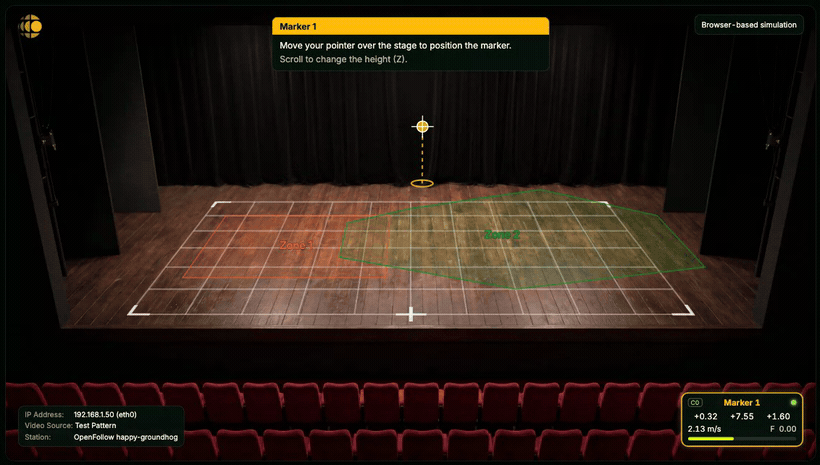

<p align="center">
  
</p>

<p align="center">
  Track people and objects on stage with a live video overlay, and broadcast positions via PSN (PosiStageNet) and OTP (Object Transform Protocol) to show control tools like lighting consoles, tracker processors, media servers, and audio processors.</p>
<p align="center">
  <b>Raspberry Pi is the recommended deployment target.</b> macOS support is for development only.
</p>

<p align="center">
  <a href="../../actions/workflows/ci.yml"></a>
  <a href="../../releases/latest"></a>
  <a href="https://buymeacoffee.com/openfollow"></a>
</p>

<p align="center">
  <a href="https://openfollow.app">Website</a> &nbsp;·&nbsp;
  <a href="https://openfollow.app/docs/">Docs</a> &nbsp;·&nbsp;
  <a href="../../releases">Releases</a> &nbsp;·&nbsp;
  <a href="#installation">Install</a> &nbsp;·&nbsp;
  <a href="docs/DEVELOPMENT.md">Development</a> &nbsp;·&nbsp;
  <a href="#license">License</a>
</p>

---

<p align="center">
  
</p>

## Overview

You get a live video view with an overlay, control 3D markers with a gamepad, mouse, or keyboard, and broadcast their positions to show-control tools like lighting consoles and media servers.

> [!WARNING]
> OpenFollow is intended to coordinate visual and audio elements of a production and should not be used for safety critical applications.

### Video input

| Source | Notes |
| --- | --- |
| RTSP / SRT / RTP | Network video streams |
| NDI® | Requires the [NDI SDK](https://ndi.video/for-developers/ndi-sdk/) (NDI® is a registered trademark of Vizrt NDI AB) |
| Raspberry Pi Camera | CSI / MIPI ribbon camera |
| USB camera / HDMI capture card | V4L2 |

### Key features

- **Interactive overlay** – position 3D markers on a live video view
- **Multi-protocol output** – PSN, OTP, OSC, and RTTrPM for industry-standard show-control integration (see [Integrations](#integrations))
- **OSC input** – receive `/marker/{id} x y z` position jumps
- **Web UI configuration** – no manual file editing
- **Affordable hardware** – designed to run reliably on a Raspberry Pi 5

### Integrations

OpenFollow broadcasts marker positions over four industry-standard protocols:

| Protocol | What it is | Spec |
| --- | --- | --- |
| PSN | PosiStageNet stage-position protocol | [posistage.net](https://posistage.net/) |
| OTP | Object Transform Protocol | [otprotocol.org](https://otprotocol.org/) |
| OSC | Open Sound Control messages | – |
| RTTrPM | Real-Time Tracking Protocol (Motion) | [RTTrPM wiki](https://rttrp.github.io/RTTrP-Wiki/RTTrPM.html) |

Known-compatible tools include grandMA3, ETC Eos 3.3, QLab 5, ADM OSC, LightStrike, ETC Hog 5, ChamSys, Avolites, and many more.

---

## System requirements

OpenFollow targets **Raspberry Pi 5 class hardware or better**, driving a **Full HD
display**. Earlier Raspberry Pi models do not keep up with the video pipeline.

- **Hardware:** Raspberry Pi 5, Compute Module 5, or Pi 500 – or a 4-core x86_64 PC
  (Intel Core 8th gen / N100 / AMD Zen or newer) with a graphics output
- **Memory and storage:** 4 GB RAM and 16 GB storage minimum; 8 GB RAM and 32 GB
  recommended. Person detection needs 8 GB (and AVX2 on x86_64)
- **Display:** 1920×1080, connected at all times – OpenFollow runs as a fullscreen kiosk
- **Network:** wired Gigabit Ethernet – Wi-Fi does not carry the 60 Hz PSN multicast stream reliably
- **Operating system:** Raspberry Pi OS Lite (64-bit, Trixie) or Debian 13 (Trixie); the
  `.deb` needs **Python 3.13** on the host

**Not supported:** Raspberry Pi 4 and earlier, 32-bit operating systems, Raspberry Pi OS
with Desktop, headless servers and virtual machines without a GPU, and Wi-Fi as the only
network connection.

The full requirements, with the reasoning behind each, are on the website:
[Hardware](https://openfollow.app/docs/hardware.html).

---

## Installation

Install a pre-built release from the [Releases page](../../releases). Pick the
artifact for your hardware:

| Hardware | How to install |
| --- | --- |
| Raspberry Pi 5 (SD card) | Flash `openfollow-pi5_<version>.img.xz` – [steps](https://openfollow.app/docs/installation.html#pi5) |
| Compute Module 5 (eMMC) | Flash `openfollow-cm5_<version>.img.xz` – [steps](https://openfollow.app/docs/installation.html#cm5) |
| Pi 5 or CM5 with Raspberry Pi OS Lite already installed | Install the `.deb` package – [steps](https://openfollow.app/docs/installation.html#deb) |
| x86_64 PC running Debian 13 | Install the `.deb` package – [steps](https://openfollow.app/docs/installation.html#amd64) |
| Other Debian machine, or macOS | Build from source – [docs/DEVELOPMENT.md](docs/DEVELOPMENT.md) (development only) |

The image is Raspberry Pi OS Lite with OpenFollow pre-installed. Flash it with
**Raspberry Pi Imager** (**Choose OS → Use custom**) and it boots straight into the
app on HDMI.

For the `.deb`, download `openfollow_<version>_<arch>.deb` (`arm64` for a Pi, `amd64`
for an x86_64 PC) and install it:

```bash
sudo apt update
sudo apt upgrade -y
sudo apt install -y ./openfollow_*.deb
```

Each release also ships a signed `openfollow_<version>_<arch>.ofupdate` bundle – that
one is for the in-app updater; for a manual install grab the `.deb`.

### Configure

OpenFollow is configured from the built-in web interface at `http://<host-ip>`, from any
browser on the same network. Use it to select your video source, set PSN/network settings,
and manage markers/controllers. Changes apply live when possible; settings that require a
restart will prompt you in the UI.

A built-in **Setup Wizard** (accessible from the Camera & Grid tab) guides you through camera positioning and grid calibration step by step – including a live preview overlay, draggable reference and corner points, and automatic DLT camera solve.

### Updating OpenFollow

Update from the **General → Software Update** page of the Web UI:

- **Check & Install Latest** downloads, verifies, and installs the newest release
  (needs internet on the device).
- **Offline install** installs a signed `.ofupdate` bundle you upload over the LAN
  (no internet).

See the [Software Update help](openfollow/web/help/general-software-update.md) for
details.

---

## Security notes

OpenFollow is designed for trusted LAN deployment, but a few knobs are worth reviewing before running on a shared production network. To report a vulnerability, see [SECURITY.md](SECURITY.md); please don't open a public issue.

- **Web PIN (`web_pin`):** set a PIN under General → Network to require authentication for every non-asset route. Browser sessions use a `SameSite=Strict` cookie; peer-to-peer broadcasts between OpenFollow instances are HMAC-signed (the PIN itself never travels on the wire). Unset PIN = open, useful for bench testing only.
- **OSC input allowlist (`osc.allowed_sender_ips`):** any LAN device can otherwise inject `/marker/{id} x y z` messages and hijack marker positions. Leave empty only while you're sure the LAN is trusted – OpenFollow logs a prominent warning at startup in that case. List one IP per authorised control surface (lighting console, touch panel, etc.).
- **Peer broadcast:** outgoing peer-sync requests are restricted to private (RFC 1918 / link-local / loopback) destinations.
- **Updates:** the Web UI can install a new release (download-from-GitHub or operator-uploaded) and restart the service. Updates ship as a signed `.ofupdate` bundle; the device verifies the release signature and checksum before installing as root and fails closed otherwise, so only an officially signed package installs. Anyone with the web PIN can still trigger an update, so treat the PIN as operator credentials.

---

## Development

Building from source, the macOS and Linux development environments, source installs on a
Raspberry Pi, and the test suite are covered in [docs/DEVELOPMENT.md](docs/DEVELOPMENT.md).
The code layout is in [docs/PROJECT_STRUCTURE.md](docs/PROJECT_STRUCTURE.md); building the
`.deb`, the Pi image, and the macOS `.dmg` is in [docs/PACKAGING.md](docs/PACKAGING.md).

---

## License

Copyright (C) 2026 The OpenFollow Project – Paul Hermann, Michel Honold, Vinzenz Schultz

OpenFollow is free software: you can redistribute it and/or modify it under the terms of the
**GNU Affero General Public License** as published by the Free Software Foundation, either
**version 3 of the License, or (at your option) any later version**.

OpenFollow is distributed in the hope that it will be useful, but WITHOUT ANY WARRANTY; without
even the implied warranty of MERCHANTABILITY or FITNESS FOR A PARTICULAR PURPOSE. See the GNU
Affero General Public License for more details.

You should have received a copy of the GNU Affero General Public License along with OpenFollow (see
[`LICENSE`](LICENSE)). If not, see <https://www.gnu.org/licenses/>.

OpenFollow is operated over a network through its web UI, so the Affero clause (AGPL §13) applies:
every user interacting with it remotely is offered the complete corresponding source. The running
web UI links directly to this repository from its **About** page to satisfy that offer.

The AGPL applies to the OpenFollow code only. The OpenFollow name, logo, and all OpenFollow
branding are © Michel Honold, Paul Hermann, Vinzenz Schultz – **all rights reserved** and are not
covered by the AGPL.

The Raspberry Pi appliance image bundles a complete operating system (Debian GNU/Linux, predominantly
GPL-2.0 and compatible licenses) alongside OpenFollow. The two are independent works combined on one
medium (**mere aggregation**): the OS keeps its own licenses and OpenFollow keeps the AGPL – see
[`THIRD_PARTY_NOTICES.md`](THIRD_PARTY_NOTICES.md) and [`WRITTEN_OFFER.md`](WRITTEN_OFFER.md).

> [!NOTE]
> NDI® is a registered trademark of Vizrt NDI AB. The optional NDI video input requires the
> separately-installed, proprietary [NDI SDK](https://ndi.video/for-developers/ndi-sdk/), which is
> not part of OpenFollow and is loaded dynamically only when present.

Third-party components bundled with, depended on, or linked by OpenFollow – and their licenses – are
catalogued in [`THIRD_PARTY_NOTICES.md`](THIRD_PARTY_NOTICES.md).
